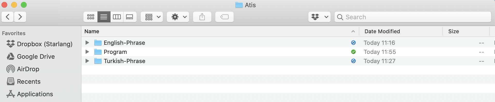
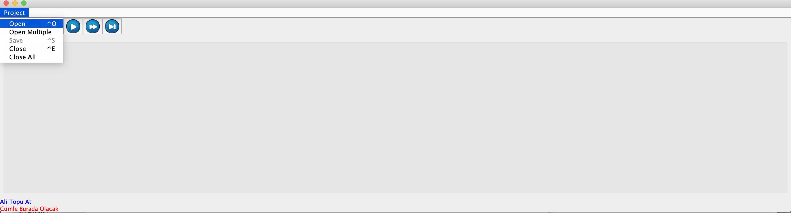
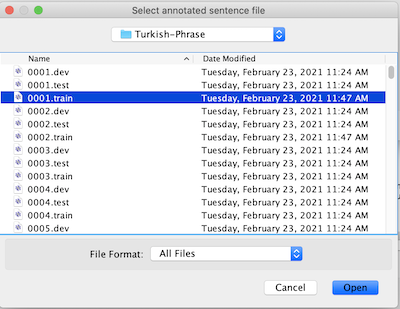
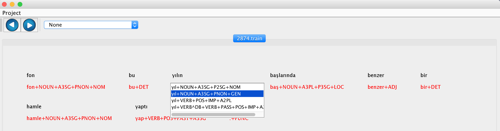

# Morphological Disambiguation

## Task Definition

Morphological disambiguation is the problem of selecting accurate morphological parse of a word given its possible parses. These parses are generated by a morphological analyzer. In morphologically rich languages like Turkish, the number of possible parses for a given word is generally more than one. Each parse is considered as a different interpretation of a single word. Each interpretation consists of a root word and sequence of inflectional and derivational suffixes. The following table illustrates different interpretations of the word ‘‘üzerine’’.

üzer+Noun+A3sg+P3sg+Dat  
üzer+Noun+A3sg+P2sg+Dat  
üz+Verb+Pos+Aor+^DB+Adj+Zero+^DB+Noun+Zero+A3sg+P3sg+Dat  
üz+Verb+Pos+Aor+^DB+Adj+Zero+^DB+Noun+Zero+A3sg+P2sg+Dat

As seen above, the first two parses share the same root but different suffix sequences. Similarly, the last two parses also share the same root, however sequence of morphemes are different. Given a parse such as

üz+Verb+Pos+Aor+^DB+Adj+Zero+^DB+Noun+Zero+A3sg+P3sg+Dat

each item is separated by ‘‘+’’ is a morphological feature such as Pos or Aor. Inflectional groups are identified as sequence of morphological features separated by derivational boundaries ^DB. The sequence of inflectional groups forms the term tag. Root word plus tag is named as word form.  So, a word form is defined as follows:

IGroot+IG<sub>1</sub>+^DB+IG<sub>2</sub>+^DB+...+^DB+IG<sub>n</sub>

Then the morphological disambiguation problem can be defined as follows: For a given sentence represented by a sequence of words W = w<sub>1</sub><sup>n</sup> = w<sub>1</sub>, w<sub>2</sub>, ..., w<sub>n</sub>, determine the sequence of parses T = t<sub>1</sub><sup>n</sup> = t<sub>1</sub>, t<sub>2</sub>, ..., t<sub>n</sub>; where t<sub>i</sub> represents the correct parse of the word w<sub>i</sub>.

## Data Annotation

### Preparation

1. Collect a set of sentences to annotate. 
2. Each sentence in the collection must be named as xxxx.yyyyy in increasing order. For example, the first sentence to be annotated will be 0001.train, the second 0002.train, etc.
3. Put the sentences in the same folder such as *Turkish-Phrase*.
4. Build the project and put the generated sentence-morphological-analyzer.jar file into another folder such as *Program*.
5. Put *Turkish-Phrase* and *Program* folders into a parent folder.


### Annotation

1. Open sentence-morphological-analyzer.jar file.
2. Wait until the data load message is displayed.
3. Click Open button in the Project menu.

4. Choose a file for annotation from the folder *Turkish-Phrase*.  

5. For each word in the sentence, click the word, and choose correct morphological analysis for that word.

6. Click one of the next buttons to go to other files.

## Classification DataSet Generation

After annotating sentences, you can use [DataGenerator](https://github.com/starlangsoftware/DataGenerator) package to generate classification dataset for the Morphological Disambiguation task.

## Generation of ML Models

After generating the classification dataset as above, one can use the [Classification](https://github.com/starlangsoftware/Classification) package to generate machine learning models for the Morphological Disambiguation task.

Simple Web Interface
============
[Link 1](http://104.247.163.162/nlptoolkit/turkish-morphological-disambiguation.html) [Link 2](https://starlangsoftware.github.io/nlptoolkit-web-simple/turkish-morphological-disambiguation.html)

Annotated Datasets
============
[Framenet & Tourism](http://104.247.163.162/nlptoolkit/turkish-disambiguation1.html)

[Atis & Gb & Pud & Imst & Boun](http://104.247.163.162/nlptoolkit/turkish-disambiguation2.html)

[Kenet](http://104.247.163.162/nlptoolkit/turkish-disambiguation3.html)

[Penn-Treebank](http://104.247.163.162/nlptoolkit/turkish-disambiguation4.html)

Video Lectures
============

[](https://youtu.be/vhp6Mse1vdM)[](https://youtu.be/lkFhIKdDSvw)[](https://youtu.be/ajXkhb8Hg3c)

For Developers
============

You can also see [Python](https://github.com/starlangsoftware/TurkishMorphologicalDisambiguation-Py), [Cython](https://github.com/starlangsoftware/TurkishMorphologicalDisambiguation-Cy), [C++](https://github.com/starlangsoftware/TurkishMorphologicalDisambiguation-CPP), [C](https://github.com/starlangsoftware/TurkishMorphologicalDisambiguation-C), [Swift](https://github.com/starlangsoftware/TurkishMorphologicalDisambiguation-Swift), [Js](https://github.com/starlangsoftware/TurkishMorphologicalDisambiguation-Js), [Php](https://github.com/starlangsoftware/TurkishMorphologicalDisambiguation-Php), or [C#](https://github.com/starlangsoftware/TurkishMorphologicalDisambiguation-CS) repository.

## Requirements

* [Java Development Kit 8 or higher](#java), Open JDK or Oracle JDK
* [Maven](#maven)
* [Git](#git)

### Java 

To check if you have a compatible version of Java installed, use the following command:

    java -version
    
If you don't have a compatible version, you can download either [Oracle JDK](https://www.oracle.com/technetwork/java/javase/downloads/jdk8-downloads-2133151.html) or [OpenJDK](https://openjdk.java.net/install/)    

### Maven
To check if you have Maven installed, use the following command:

    mvn --version
    
To install Maven, you can follow the instructions [here](https://maven.apache.org/install.html).     

### Git

Install the [latest version of Git](https://git-scm.com/book/en/v2/Getting-Started-Installing-Git).

## Download Code

In order to work on code, create a fork from GitHub page. 
Use Git for cloning the code to your local or below line for Ubuntu:

	git clone <your-fork-git-link>

A directory called MorphologicalDisambiguation will be created. Or you can use below link for exploring the code:

	git clone https://github.com/starlangsoftware/TurkishMorphologicalDisambiguation.git

## Open project with IntelliJ IDEA

Steps for opening the cloned project:

* Start IDE
* Select **File | Open** from main menu
* Choose `MorphologicalDisambiguation/pom.xml` file
* Select open as project option
* Couple of seconds, dependencies with Maven will be downloaded. 

## Compile

**From IDE**

After being done with the downloading and Maven indexing, select **Build Project** option from **Build** menu. After compilation process, user can run `MorphologicalDisambiguation`.

**From Console**

Use below line to generate jar file:

     mvn install

## Maven Usage

        <dependency>
            <groupId>io.github.starlangsoftware</groupId>
            <artifactId>MorphologicalDisambiguation</artifactId>
            <version>1.0.11</version>
        </dependency>

Detailed Description
============

+ [Creating MorphologicalDisambiguator](#creating-morphologicaldisambiguator)
+ [Training MorphologicalDisambiguator](#training-morphologicaldisambiguator)
+ [Sentence Disambiguation](#sentence-disambiguation)

## Creating MorphologicalDisambiguator 

MorphologicalDisambiguator provides Turkish morphological disambiguation. There are possible disambiguation techniques. Depending on the technique used, disambiguator can be instantiated as follows:

* Using `RootFirstDisambiguation`, the one that chooses only the root amongst the given analyses

        morphologicalDisambiguator = new RootFirstDisambiguation();

* Using `RootWordStatisticsDisambiguation`, the one that chooses the root that is the most frequently used amongst the given analyses

        morphologicalDisambiguator = new RootWordStatisticsDisambiguation();

* Using `LongestRootFirstDisambiguation`, the one that chooses the longest root among the given roots
        
        morphologicalDisambiguator = new LongestRootFirstDisambiguation();

* Using `HmmDisambiguation`, the one that chooses using an Hmm-based algorithm
        
        morphologicalDisambiguator = new HmmDisambiguation();

* Using `DummyDisambiguation`, the one that chooses a random one amongst the given analyses 
     
        morphologicalDisambiguator = new DummyDisambiguation();

## Training MorphologicalDisambiguator

To train the disambiguator, an instance of `DisambiguationCorpus` object is needed. This can be instantiated and the disambiguator can be trained and saved as follows:

    DisambiguationCorpus corpus = new DisambiguationCorpus("penn_treebank.txt");
    morphologicalDisambiguator.train(corpus);
    morphologicalDisambiguator.saveModel();
    
      
## Sentence Disambiguation

To disambiguate a sentence, a `FsmMorphologicalAnalyzer` instance is required. This can be created as below, further information can be found [here](https://github.com/olcaytaner/MorphologicalAnalysis/blob/master/README.md#creating-fsmmorphologicalanalyzer).

    FsmMorphologicalAnalyzer fsm = new FsmMorphologicalAnalyzer();
    
A sentence can be disambiguated as follows: 
    
    Sentence sentence = new Sentence("Yarın doktora gidecekler");
    FsmParseList[] fsmParseList = fsm.robustMorphologicalAnalysis(sentence);
    System.out.println("All parses");
    System.out.println("--------------------------");
    for(int i = 0; i < fsmParseList.length; i++){
        System.out.println(fsmParseList[i]);
    }
    ArrayList<FsmParse> candidateParses = morphologicalDisambiguator.disambiguate(fsmParseList);
    System.out.println("Parses after disambiguation");
    System.out.println("--------------------------");
    for(int i = 0; i < candidateParses.size(); i++){
        System.out.println(candidateParses.get(i));
    }

Output

    
    All parses
    --------------------------
    yar+NOUN+A3SG+P2SG+NOM
    yar+NOUN+A3SG+PNON+GEN
    yar+VERB+POS+IMP+A2PL
    yarı+NOUN+A3SG+P2SG+NOM
    yarın+NOUN+A3SG+PNON+NOM
    
    doktor+NOUN+A3SG+PNON+DAT
    doktora+NOUN+A3SG+PNON+NOM
    
    git+VERB+POS+FUT+A3PL
    git+VERB+POS^DB+NOUN+FUTPART+A3PL+PNON+NOM
    
    Parses after disambiguation
    --------------------------
    yarın+NOUN+A3SG+PNON+NOM
    doktor+NOUN+A3SG+PNON+DAT
    git+VERB+POS+FUT+A3PL

# Cite

	@InProceedings{gorgunyildiz12,
	author="G{\"o}rg{\"u}n, Onur
	and Yildiz, Olcay Taner",
	editor="Gelenbe, Erol
	and Lent, Ricardo
	and Sakellari, Georgia",
	title="A Novel Approach to Morphological Disambiguation for Turkish",
	booktitle="Computer and Information Sciences II",
	year="2012",
	publisher="Springer London",
	address="London",
	pages="77--83",
	isbn="978-1-4471-2155-8"
	}

For Contibutors
============

### pom.xml file
1. Standard setup for packaging is similar to:
```
    <groupId>io.github.starlangsoftware</groupId>
    <artifactId>Amr</artifactId>
    <version>1.0.0</version>
    <packaging>jar</packaging>
    <name>NlpToolkit.Amr</name>
    <description>Abstract Meaning Representation Library</description>
    <url>https://github.com/StarlangSoftware/Amr</url>

    <organization>
        <name>io.github.starlangsoftware</name>
        <url>https://github.com/starlangsoftware</url>
    </organization>

    <licenses>
        <license>
            <name>The Apache Software License, Version 2.0</name>
            <url>http://www.apache.org/licenses/LICENSE-2.0.txt</url>
        </license>
    </licenses>

    <developers>
        <developer>
            <name>Olcay Taner Yildiz</name>
            <email>olcay.yildiz@ozyegin.edu.tr</email>
            <organization>Starlang Software</organization>
            <organizationUrl>http://www.starlangyazilim.com</organizationUrl>
        </developer>
    </developers>

    <scm>
        <connection>scm:git:git://github.com/starlangsoftware/amr.git</connection>
        <developerConnection>scm:git:ssh://github.com:starlangsoftware/amr.git</developerConnection>
        <url>http://github.com/starlangsoftware/amr/tree/master</url>
    </scm>

    <properties>
        <maven.compiler.source>1.8</maven.compiler.source>
        <maven.compiler.target>1.8</maven.compiler.target>
        <project.build.sourceEncoding>UTF-8</project.build.sourceEncoding>
    </properties>
```
2. Only top level dependencies should be added. Do not forget junit dependency.
```
    <dependencies>
        <dependency>
            <groupId>io.github.starlangsoftware</groupId>
            <artifactId>AnnotatedSentence</artifactId>
            <version>1.0.78</version>
        </dependency>
        <dependency>
            <groupId>junit</groupId>
            <artifactId>junit</artifactId>
            <version>4.13.1</version>
            <scope>test</scope>
        </dependency>
    </dependencies>
```
3. Maven compiler, gpg, source, javadoc plugings should be added.
```
	<plugin>
		<groupId>org.apache.maven.plugins</groupId>
		<artifactId>maven-compiler-plugin</artifactId>
		<version>3.6.1</version>
		<configuration>
			<source>1.8</source>
			<target>1.8</target>
		</configuration>
	</plugin>
	<plugin>
		<groupId>org.apache.maven.plugins</groupId>
		<artifactId>maven-gpg-plugin</artifactId>
		<version>1.6</version>
		<executions>
			<execution>
				<id>sign-artifacts</id>
				<phase>verify</phase>
				<goals>
					<goal>sign</goal>
				</goals>
			</execution>
		</executions>
	</plugin>
	<plugin>
		<groupId>org.apache.maven.plugins</groupId>
		<artifactId>maven-source-plugin</artifactId>
		<version>2.2.1</version>
		<executions>
			<execution>
				<id>attach-sources</id>
				<goals>
					<goal>jar-no-fork</goal>
				</goals>
			</execution>
		</executions>
	</plugin>
	<plugin>
		<groupId>org.apache.maven.plugins</groupId>
		<artifactId>maven-javadoc-plugin</artifactId>
		<configuration>
			<source>8</source>
		</configuration>
		<version>3.10.0</version>
		<executions>
			<execution>
				<id>attach-javadocs</id>
				<goals>
					<goal>jar</goal>
				</goals>
			</execution>
		</executions>
	</plugin>
```
4. Currently publishing plugin is Sonatype.
```
	<plugin>
		<groupId>org.sonatype.central</groupId>
		<artifactId>central-publishing-maven-plugin</artifactId>
		<version>0.8.0</version>
		<extensions>true</extensions>
		<configuration>
			<publishingServerId>central</publishingServerId>
			<autoPublish>true</autoPublish>
		</configuration>
	</plugin>
```
5. For UI jar files use assembly plugins.
```
	<plugin>
		<groupId>org.apache.maven.plugins</groupId>
		<artifactId>maven-assembly-plugin</artifactId>
		<version>2.2-beta-5</version>
		<executions>
			<execution>
				<id>sentence-dependency</id>
				<phase>package</phase>
				<goals>
					<goal>single</goal>
				</goals>
				<configuration>
					<archive>
						<manifest>
							<mainClass>Amr.Annotation.TestAmrFrame</mainClass>
						</manifest>
					</archive>
					<finalName>amr</finalName>
				</configuration>
			</execution>
		</executions>
		<configuration>
			<descriptorRefs>
				<descriptorRef>jar-with-dependencies</descriptorRef>
			</descriptorRefs>
			<appendAssemblyId>false</appendAssemblyId>
		</configuration>
	</plugin>
```
### Resources
1. Add resources to the resources subdirectory. These will include image files (necessary for UI), data files, etc.
   
### Java files
1. Do not forget to comment each function.
```
    /**
     * Returns the value of a given layer.
     * @param viewLayerType Layer for which the value questioned.
     * @return The value of the given layer.
     */
    public String getLayerInfo(ViewLayerType viewLayerType){
```
2. Function names should follow caml case.
```
    public MorphologicalParse getParse()
```
3. Write toString methods, if necessary.
4. Use Junit for writing test classes. Use test setup if necessary.
```
public class AnnotatedSentenceTest {
    AnnotatedSentence sentence0, sentence1, sentence2, sentence3, sentence4;
    AnnotatedSentence sentence5, sentence6, sentence7, sentence8, sentence9;

    @Before
    public void setUp() throws Exception {
        sentence0 = new AnnotatedSentence(new File("sentences/0000.dev"));
```
